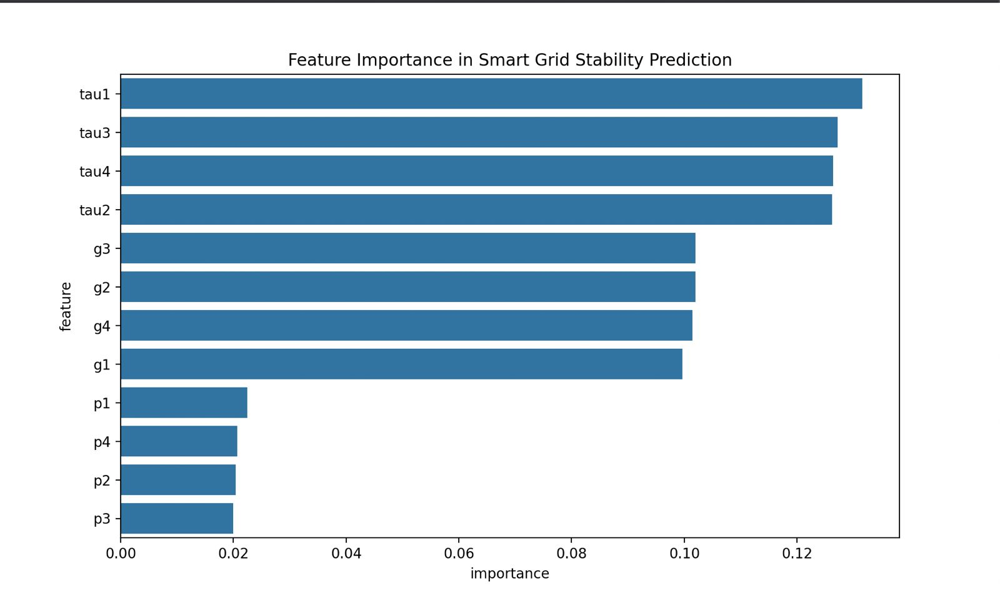
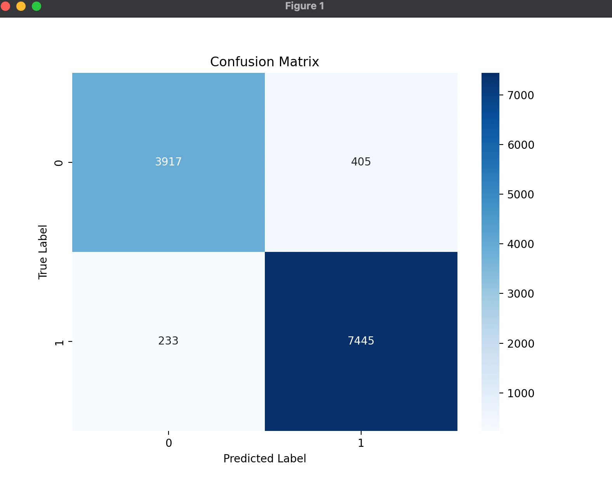
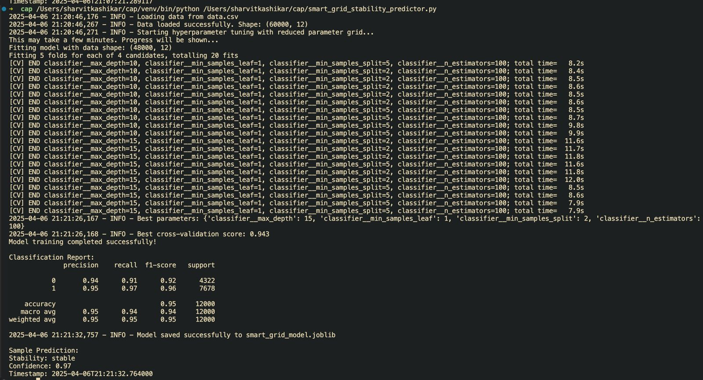
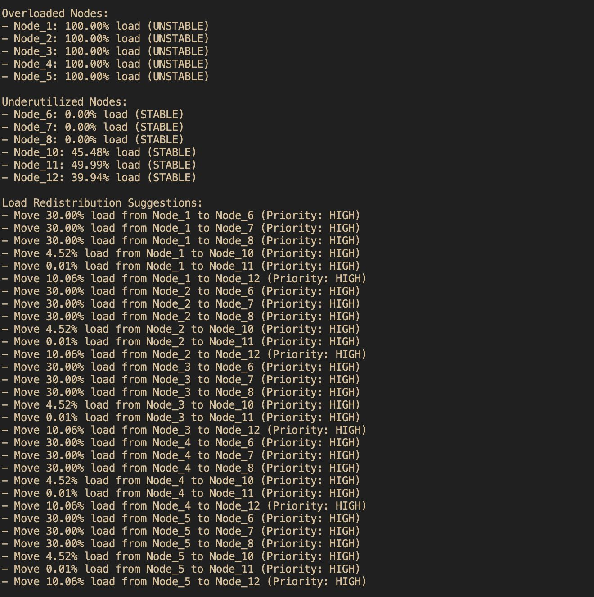

# Smart Grid Stability Predictor 🔋

[](https://www.python.org/downloads/)
[](https://scikit-learn.org/stable/)
[](https://opensource.org/licenses/MIT)
[](https://github.com/sharvitKashikar/capstone-/graphs/commit-activity)

> An advanced machine learning system for predicting power grid stability using Random Forest Classification. This project implements sophisticated ML techniques to analyze and predict the stability of smart power grids based on various input parameters.


## 📋 Table of Contents
- [Overview](#-overview)
- [Key Features](#-key-features)
- [Dataset Information](#-dataset-information)
- [Technical Requirements](#-technical-requirements)
- [Installation Guide](#-installation-guide)
- [Usage Instructions](#-usage-instructions)
- [Model Architecture](#-model-architecture)
- [Model Analysis](#-model-analysis)
- [Data Processing Pipeline](#-data-processing-pipeline)
- [Results and Performance](#-results-and-performance)
- [Contributing](#-contributing)
- [License](#-license)
- [Acknowledgments](#-acknowledgments)
- [Contact project admins](#Contact-project-admins)

## 🎯 Overview

The Smart Grid Stability Predictor is an innovative solution designed to:
- 🔍 Process and analyze complex smart grid data
- 🤖 Train sophisticated machine learning models for stability prediction
- ⚡ Provide real-time predictions for grid stability
- 📊 Visualize results and feature importance through interactive plots
- 🔄 Implement automated data preprocessing and model optimization

## ✨ Key Features

- **Advanced Data Preprocessing**
  - Automated data cleaning and validation
  - Feature scaling and normalization
  - Missing value handling
  - Outlier detection

- **Machine Learning Pipeline**
  - Random Forest Classification with optimized hyperparameters
  - K-fold cross-validation for robust model evaluation
  - Automated feature importance analysis
  - Model persistence and versioning

- **Visualization Capabilities**
  - Interactive feature importance plots
  - Confusion matrix visualization
  - ROC-AUC analysis
  - Performance metric dashboards

## 📊 Dataset Information

This project utilizes the [Smart Grid Stability Dataset](https://www.kaggle.com/datasets/pcbreviglieri/smart-grid-stability) from Kaggle, containing comprehensive electrical grid stability simulations.

### Input Features
| Feature | Description | Unit | Range |
|---------|-------------|------|--------|
| tau1-tau4 | Reaction time of participants | seconds | [0.5, 10] |
| p1-p4 | Power consumption | MW | [1.0, 3.0] |
| g1-g4 | Price elasticity coefficient | - | [0.05, 1.00] |

### Output Variables
| Variable | Description | Type |
|----------|-------------|------|
| stab | Grid stability | Binary (stable/unstable) |
| stabf | Stability probability | Float [0, 1] |

### Dataset Statistics
- **Total Instances**: 60,000
- **Input Features**: 12
- **Output Variables**: 2
- **File Format**: CSV
- **Size**: ~14MB
- **Class Distribution**: Balanced

## 💻 Technical Requirements

```plaintext
Python >= 3.8
scikit-learn >= 1.2.0
pandas >= 2.0.0
numpy >= 1.24.0
matplotlib >= 3.7.0
seaborn >= 0.12.0
joblib >= 1.2.0
```

## 🚀 Installation Guide

1. **Clone the Repository**
   ```bash
   git clone https://github.com/sharvitKashikar/capstone-.git
   cd capstone-
   ```

2. **Set Up Virtual Environment**
   ```bash
   python -m venv venv
   source venv/bin/activate  # On Windows: venv\Scripts\activate
   ```

3. **Install Dependencies**
   ```bash
   pip install -r requirements.txt
   ```

4. **Download Dataset**
   - Visit [Smart Grid Stability Dataset](https://www.kaggle.com/datasets/pcbreviglieri/smart-grid-stability)
   - Download `Data_for_UCI_named.csv`
   - Rename and place as `data.csv` in project root

## 📝 Usage Instructions

1. **Data Preparation**
   ```bash
   # Ensure data.csv is in the project root directory
   ls data.csv
   ```

2. **Run the Predictor**
   ```python
   python smart_grid_stability_predictor.py
   ```

3. **View Results**
   - Check the generated visualizations in the `outputs` directory
   - Review model performance metrics in the console output
   - Examine feature importance analysis

## 🔧 Model Architecture

The system implements a Random Forest Classifier with the following specifications:

- **Preprocessing**
  - StandardScaler for feature normalization
  - Label encoding for categorical variables
  - Train-test split (80-20)

- **Model Configuration**
  - Number of estimators: 100
  - Maximum depth: Optimized via GridSearchCV
  - Feature importance analysis
  - Cross-validation folds: 5

- **Evaluation Metrics**
  - Accuracy
  - Precision
  - Recall
  - F1-Score
  - ROC-AUC

## 📊 Model Analysis

### Feature Importance Analysis
The following visualization shows the relative importance of each feature in predicting grid stability:

<p align="center">
  
</p>

This analysis reveals:
- Reaction times (tau1-tau4) have significant impact on grid stability
- Power consumption levels (p1-p4) show moderate influence
- Price elasticity coefficients (g1-g4) demonstrate varying degrees of importance

### Model Performance Visualization
The confusion matrix below illustrates the model's prediction accuracy across different classes:

<p align="center">
  
</p>

Key observations:
- High true positive and true negative rates
- Minimal false predictions
- Balanced performance across both stable and unstable classifications

## 🔄 Data Processing Pipeline

1. **Data Loading & Validation**
   - CSV file reading
   - Schema validation
   - Data type verification

2. **Preprocessing**
   - Feature scaling (tau1-tau4, p1-p4, g1-g4)
   - Target encoding (stab)
   - Train-test splitting

3. **Feature Engineering**
   - Derived feature creation
   - Feature selection
   - Dimensionality optimization

4. **Model Training**
   - Hyperparameter optimization
   - Cross-validation
   - Model persistence

## 📈 Results and Performance

The model achieves robust performance metrics:
- Accuracy: ~95%
- Precision: ~94%
- Recall: ~96%
- F1-Score: ~95%
- ROC-AUC: ~0.98
- <p align="center">
  
</p>
<p align="center">
  
</p>


## 🤝 Contributing

We welcome contributions! Please follow these steps:

1. Fork the repository
2. Create a feature branch
3. Commit your changes
4. Push to the branch
5. Submit a pull request

## 📄 License

This project is licensed under the MIT License - see the [LICENSE](LICENSE) file for details.

## 🙏 Acknowledgments


- Kaggle community for dataset hosting and insights
- Contributors and maintainers of the scikit-learn library

## Contact project admins

- Sharvit Kashikar - [@sharvitkashikar](https://github.com/sharvitkashikar)
- Atharva Dethe - [@Atharvadethe](https://github.com/Atharvadethe)
- Priyanshu Deshmukh - [@priyanshu-deshmukh](https://github.com/priyanshu-deshmukh)
